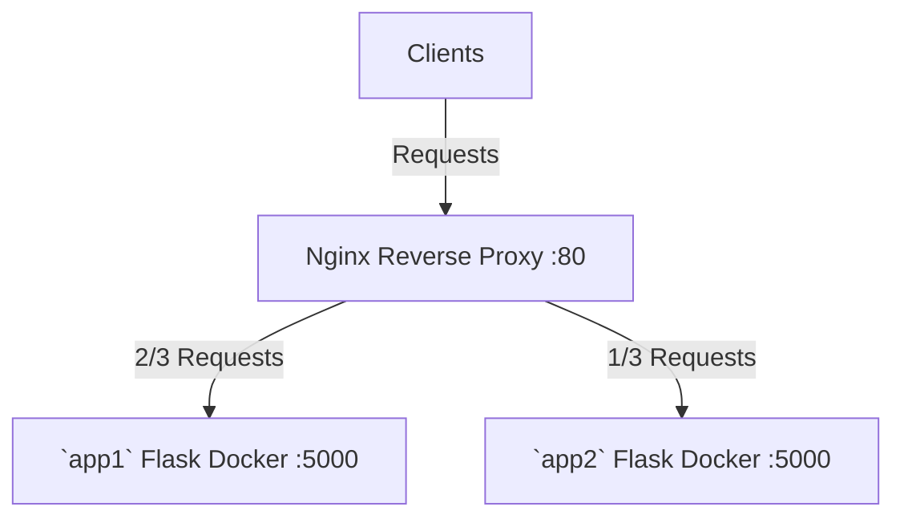

## How to Run

`docker-compose up`, then go to `localhost:8000` in your browser.

## How it works

There are two folders `app1`, `app2`. They are exactly the same except the message:
* `Hello World from app 1! I have weight 2/3.`
* `Hello World from app 2! I have weight 1/3.`

Each folder defines a Docker image that is just a Flask server (see `counter`) that replies a basic message.

The Nginx server listens on port 80. It acts as a reverse proxy that takes in all incoming requests and sends 2/3 of them to `app1` server, and 1/3 of them to `app2` server. The servers doing the real work are called "upstream" by convention. The Nginx server working as the reverse proxy is "downstream".

```conf
http {
    upstream app_servers {
        server app1:5000 weight=2; # 2 out of 3 requests will be sent to this server.
        server app2:5000 weight=1;
    }

    # Settings for the reverse proxy server, used to load balance traffic between the upstream servers.
    server {
        listen 80;

        # A location block inside the server block defines how to process specific types of requests.
        location / {
            # 'proxy_pass' directive passes the request to the upstream group of backend servers defined earlier.
            proxy_pass http://app_servers;
        }
    }
}
```

The structure, with all 3 servers, is graphed as:



The Nginx server Docker image is `nginx:1.19.0-alpine`, a standard `nginx` installed in `alpine` Linux. Its config `nginx.conf` is copied to `/etc/nginx/nginx.conf`.

```dockerfile
FROM nginx:1.19.0-alpine
COPY nginx.conf /etc/nginx/nginx.conf
```

So, there are three docker images in total, and they are composed according to `docker-compose.yml`:

```yml
version: '3'
services:
  nginx:
    build: .
    ports:
     - "8000:80"
  app1:
    build: ./app1
  app2:
    build: ./app2
```

The whole folder is structured as:

```tree
reverse-proxy/
│
├── Dockerfile
├── nginx.conf
├── docker-compose.yml
│
├── app1/
│   ├── Dockerfile
│   ├── app.py
│   └── requirements.txt
│
└── app2/
    ├── Dockerfile
    ├── app.py
    └── requirements.txt
```

