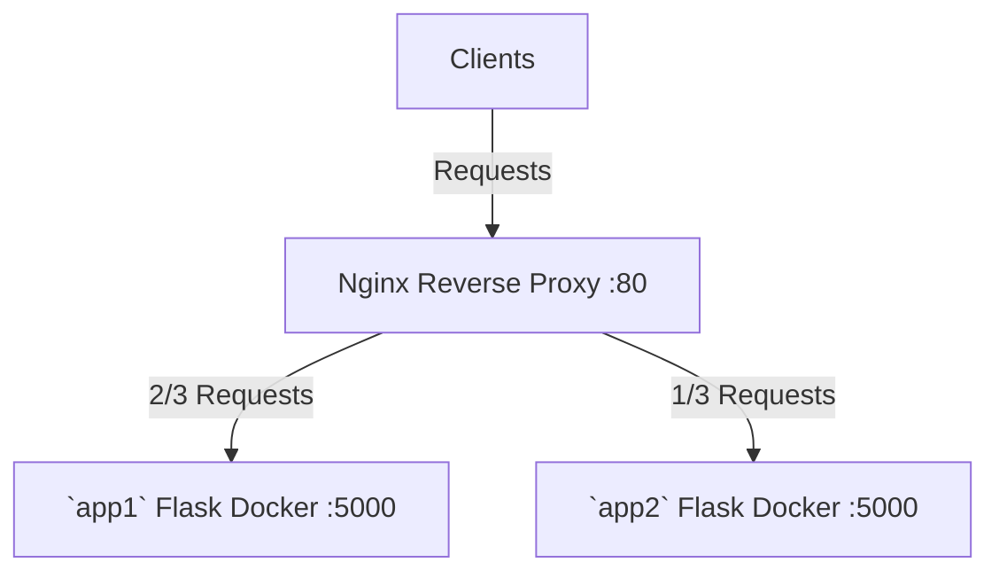

# Reverse Proxy with Nginx

## How to Run

`docker-compose up`, then go to `localhost:8000` in your browser. Keep pressing refresh to see the response occasionally change. It should look like `Hello World from app 1! I have weight 2/3. Current time is 2023-06-14 13:48:08.147072`.

There are three servers, structured as follows:



The Nginx server faces the outside world. Every request goes through it to one of the two upstream Flask servers. The Nginx server also caches responses for 2 seconds, so the response `Current time` changes only once every more than 2 seconds. It also performs load-balancing, so 2/3 of the times you get server 1, and 1/3 of the times you get server 2.

## How it works

There are two folders `app1`, `app2`. They are exactly the same except the message:
* `Hello World from app 1! I have weight 2/3. Current time is <current time>.`
* `Hello World from app 2! I have weight 1/3. Current time is <current time>.`

Each folder defines a Docker image that is just a Flask server (see `counter`) that replies a basic message.

The Nginx server listens on port 80. It acts as a reverse proxy that takes in all incoming requests and sends 2/3 of them to `app1` server, and 1/3 of them to `app2` server. The servers doing the real work are called "upstream" by convention. The Nginx server working as the reverse proxy is "downstream".

It also caches responses from upstream servers for a fixed amount of time:
* `proxy_cache_valid 200 302 2s`: 200 and 302 responses for 2 seconds.
* `proxy_cache_valid 404 1s`: 404 responses for 1 minute.

The cache is configured as:
- `levels=1:2`: The cache will be stored in a directory tree of 1 level, with each directory containing up to 2 subdirectories.
- `keys_zone=my_cache:10m`: The cache will be named my_cache and will use 10MB of memory.
- `max_size=1g`: The cache will use at most 1GB of disk space.
- `inactive=60m`: If a cached file is not accessed within 60 minutes, it will be deleted from the cache.
- `use_temp_path=off`: The cache will not use the default temp path, but will use the path specified in `proxy_cache_path`, which is `/var/cache/nginx`.

There's also a `event {}` section. Without it, the Nginx server just immediately closes with error message `reverse-proxy-web-1   | nginx: [emerg] no "events" section in configuration`.

According to ChatGPT, though it's not strictly required for every NGINX configuration, the absence of this section can sometimes cause issues, depending on the specifics of the environment NGINX is running in, so one should always add that just as defensive boilerplate.

The Nginx server Docker image is `nginx:1.19.0-alpine`, a standard `nginx` installed in `alpine` Linux. Its config `nginx.conf` is copied to `/etc/nginx/nginx.conf`.

```dockerfile
FROM nginx:1.19.0-alpine
COPY nginx.conf /etc/nginx/nginx.conf
```

So, there are three docker images in total, and they are composed according to `docker-compose.yml`:

```yml
version: '3'
services:
  nginx:
    build: .
    ports:
     - "8000:80"
  app1:
    build: ./app1
  app2:
    build: ./app2
```

The whole folder is structured as:

```tree
reverse-proxy/
│
├── Dockerfile
├── nginx.conf
├── docker-compose.yml
│
├── app1/
│   ├── Dockerfile
│   ├── app.py
│   └── requirements.txt
│
└── app2/
    ├── Dockerfile
    ├── app.py
    └── requirements.txt
```

